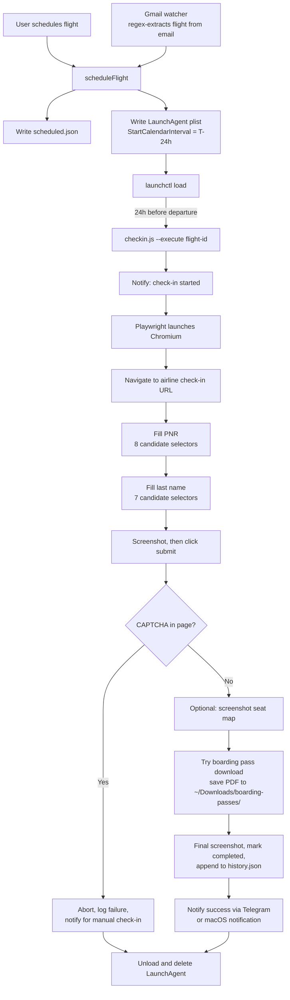

# Airline Auto Check-in Skill

Schedules and executes flight check-in exactly 24 hours before departure using macOS launchd for timing and Playwright for the browser work, with pre-configured support for 8 airlines.

## What it does

- Stores flight details (airline, booking reference, last name, departure time) in `~/.openclaw/flights/scheduled.json` and creates one macOS LaunchAgent per flight, timed to fire 24 hours before departure
- At trigger time, launches Chromium via Playwright, navigates to the airline's check-in page, and fills the confirmation code and last name using 8 confirmation-field selectors and 7 name-field selectors to survive markup differences between airlines
- Detects CAPTCHA pages and aborts with a notification instead of attempting to bypass them
- Attempts to download the boarding pass PDF to `~/Downloads/boarding-passes/` and captures before-submit and completion screenshots for every run
- Sends a Telegram notification on start, success, and failure, falling back to a native macOS notification when Telegram credentials are not set
- Includes a Gmail watcher module that extracts airline, booking reference, last name, and departure time from confirmation emails with regex patterns and schedules check-ins automatically, deduplicating by message ID

## Why it exists

Check-in windows open 24 hours before departure, which is usually an inconvenient time, and on airlines with open seating the first minutes matter. Doing this manually means setting an alarm and racing through a form. This tool moves the race to a scheduled job on your own machine: you register the flight once (or let the Gmail watcher find it), and the boarding pass shows up in your downloads folder.

## Architecture

Trigger-to-boarding-pass flow as implemented in `checkin.js` and `gmail-watcher.js`:



## Quick start

```bash
# 1. Copy the skill into place
cp -r airline-checkin-skill ~/.openclaw/skills/user/airline-checkin/

# 2. Make the script executable (the LaunchAgent invokes it directly)
chmod +x ~/.openclaw/skills/user/airline-checkin/checkin.js

# 3. Install the one dependency and the Chromium build
cd ~/.openclaw/skills/user/airline-checkin
npm install
npx playwright install chromium

# 4. Verify
node ~/.openclaw/skills/user/airline-checkin/checkin.js --list
```

Or run `./install.sh`, which performs the same steps.

Optional Telegram notifications (otherwise macOS notifications are used):

```bash
export TELEGRAM_BOT_TOKEN="your-bot-token"
export TELEGRAM_CHAT_ID="your-chat-id"
```

Schedule a flight from Node (synthetic example):

```javascript
const { scheduleFlight } = require('~/.openclaw/skills/user/airline-checkin/checkin.js');

scheduleFlight({
  airline: 'Air Canada',
  pnr: 'ZZTEST',
  lastName: 'Example',
  departureTime: '2026-09-25T10:45:00-04:00',
  timezone: 'EDT'
});
```

CLI commands:

```bash
node checkin.js --list              # show scheduled check-ins
node checkin.js --cancel ZZTEST     # cancel by PNR or flight id
node checkin.js --execute <id>      # run a check-in now
```

Pre-configured check-in URLs: Air Canada, United, Delta, Southwest, American, WestJet, Alaska, JetBlue. Any other airline works by passing `checkinUrl` when scheduling.

## Design decisions

- **launchd over a daemon.** Each flight gets its own LaunchAgent plist with a `StartCalendarInterval`, so nothing runs between flights and a crash cannot take out other scheduled check-ins. The plist is unloaded and deleted after execution, success or failure.
- **Selector lists over per-airline scrapers.** Form fields are located by trying ordered lists of generic selectors (name, id, and placeholder patterns) rather than maintaining a scraper per airline. This trades reliability on unusual markup for zero per-airline maintenance. Seat selection is not implemented; if a seat map is detected, the script only screenshots it.
- **Fail loudly, never bypass.** CAPTCHA detection aborts the run and notifies the user. Every run leaves screenshots and an entry in `history.json`, so a 6 a.m. failure is diagnosable after the fact.
- **All state is local plain-text JSON.** Confirmation codes are not encrypted at rest, and completed flights are marked `completed` in `scheduled.json` rather than deleted. Treat the state directory as sensitive.

## Limitations

- macOS only (LaunchAgents for scheduling, `osascript` for fallback notifications)
- The Mac must be awake at check-in time
- Cannot bypass CAPTCHA or bot detection; it notifies you to finish manually
- Airlines that require passport data, special assistance, or airport check-in will fail with a logged error
- The Gmail watcher is a library module: it requires the host agent to supply Gmail search and read functions and exits if run directly

## Status

Experimental. The scheduling, execution, notification, and history paths are implemented end to end, but the browser flow relies on heuristic selectors, runs headed by default (`headless: false` with a note to flip it for production), and has no automated tests. Verify check-in succeeded before heading to the airport.
